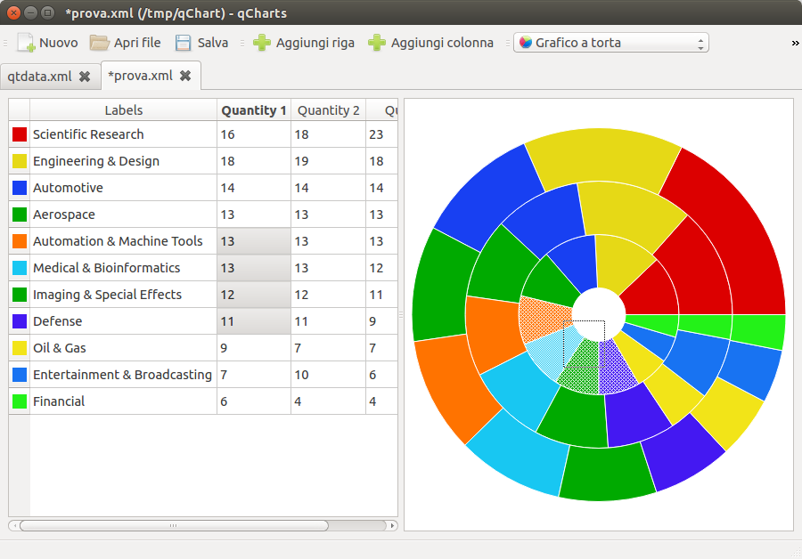

qCharts
=======

`qCharts` is an academic project. It allows to edit and visualize numeric charts in different formats (bar chart, pie chart, line chart, ...). It uses XML as storage format.


[](https://travis-ci.org/fpoli/qCharts)
[](https://scan.coverity.com/projects/2794)

# Screenshot



# Requirements

On `Ubuntu 14.04` all the dependencies are installed by

```
sudo apt-get install libqt4-dev qt4-qmake
```


# Compile

- `qmake -project`
- `qmake`
- `make`


# Run

- `./qCharts`
- (load a demo file)
- (enjoy the animations)
